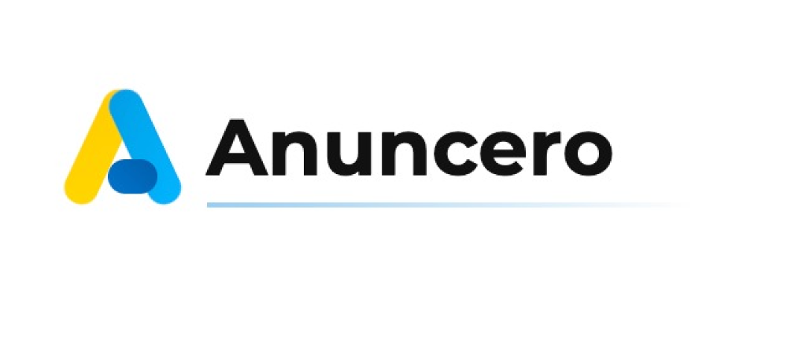

# Anuncero Prensa - Premium B2B Editorial Theme

**Anuncero Prensa** es un tema de WordPress de altísima calidad (Premium UI) diseñado para plataformas de noticias, periodismo B2B y revistas digitales. Está construido sobre principios de **arquitectura SOLID**, enfocado al 100% en la optimización SEO, Core Web Vitals y un sistema de diseño "Brutal UI".

---

## Patrocinado por Anuncero.press

Este tema es 100% de código abierto (MIT) y ha sido desarrollado y liberado al público por el equipo de ingeniería de **[Anuncero.press](https://anuncero.press)**. 

Si tienes un medio de comunicación o portal de noticias y quieres empezar a **monetizar tu tráfico vendiendo banners directamente a anunciantes sin intermediarios**, utiliza nuestra plataforma.

**[Regístrate gratis en Anuncero.press](https://anuncero.press)** y descubre cómo revolucionamos el modelo publicitario para editores independientes.

---

## Características del Tema

- **Diseño Asimétrico y Staggered:** Grillas de noticias que se renderizan mediante IntersectionObservers con una entrada escalonada ultra-suave.
- **Tipografía de Alta Gama:** Uso de Outfit para UI/Titulares y Merriweather para el cuerpo del texto. Limitación del ancho a 720px para una lectura inmersiva sin fatiga visual.
- **Micro-animaciones (UX):** Feedback sensorial en botones, zoom-in sutil en portadas (scale: 1.03) e interacción táctil en todos los links.
- **Sin Dependencias Innecesarias:** Código limpio sin jQuery, CSS moderno fluido (variables nativas) independiente sin frameworks pesados, logrando un rendimiento perfecto.
- **Preparado para Autores:** Caja de autor nativa (Author Box), artículos relacionados y compartición social integrada sin necesidad de plugins extra que ralenticen la web.

## Instalación

1. Descarga el repositorio en formato `.zip`.
2. Súbelo a tu WordPress en `Apariencia > Temas > Añadir Nuevo`.
3. Actívalo. El logotipo oficial de Anuncero se mostrará por defecto, pero puedes configurar el tuyo propio desde el Personalizador de WordPress.

## Licencia

Este proyecto está bajo la Licencia MIT. Eres libre de usarlo, modificarlo y distribuirlo, pero te agradecemos si dejas los créditos de desarrollo apuntando hacia [Anuncero.press](https://anuncero.press).
